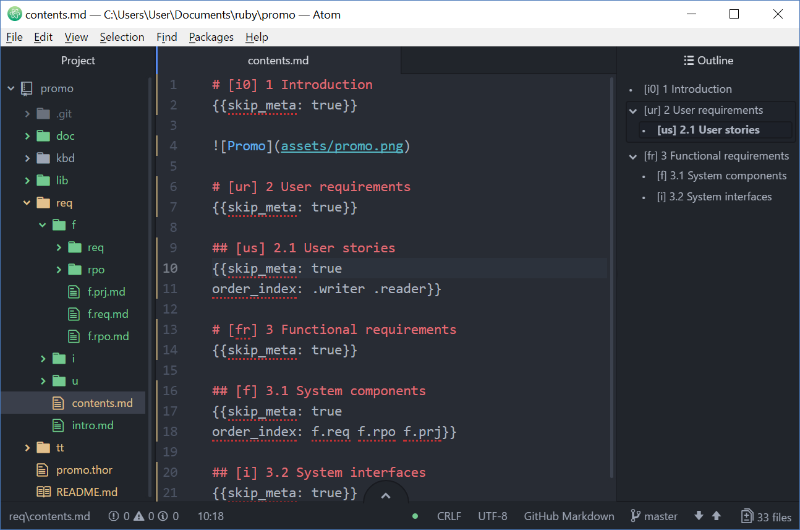

# Creq

[](https://gitter.im/nvoynov-creq/Lobby?utm_source=badge&utm_medium=badge&utm_campaign=pr-badge&utm_content=badge)

[](https://badge.fury.io/rb/creq) [](https://travis-ci.org/nvoynov/creq) [](https://codeclimate.com/github/nvoynov/creq)

The CReq is a simple and customizable tool for requirements management. It provides ability of writing requirements in isolated markdown files and combining those files into a single and consistent requirements specification document.

The CReq is simple enough in itself, but when you combine it with Ruby, a modern text editor and Git, this combination will bring you unprecedented power and flexibility in requirements management.



## Purpose

Develop a simple and efficient approach for requirements management practice (gathering and writing; prioritizing and efforts estimation; tracing to other project artifacts) through exploring:
* a sufficient and custom format to describe requirement by analysts and consume those by project members team (unique requirement identification; requirement attributes suitable to certain project);
* a consistent requirements repository format that will be easy understandable for both human and machine;
* a minimum set of required tools with the possibility of rapid adoption to a certain project needs, that are free and ready to use.

## Installation

Install the creq gem:

    $ gem install creq

Of course you can choose the other standard way through cloning repository and installing the gem by hand (you must also have [Bundler](http://bundler.io/) installed):

    $ git clone https://github.com/nvoynov/creq.git
    $ cd creq    
    $ bundle install
    $ bundle exec rake install

## Promo

CReq is supplied by Creq Promo Project. This project contains software requirements for Creq.

You can copy Creq Promo Project content into the current directory by `creq promo` command. When promo project is copied, you can simply create Creq Requirements Document by `creq doc` command.

## Usage

### Requirements file format

Requirements file is a usual Markdown file with a few additional compliances. Let's look at the next two example files `content.md` and `feature1.md`.

**content.md**
```markdown
# [f] Functional requirements
{{
suppress_id: true
child_order: feature1 feature2  
}}
# [i] Interfaces
# [n] Non-functional requirements
# [c] Design constraints
```

**feature1.md**
```markdown
# [f1] Feature 1
{{
parent: f
status: proposed
source: nvoynov  
}}
The System shall provide the Feature 1.

## [f1.data] Data
The System shall provide the next data for `Feature 1`

## [f1.cmd1] Command 1
The System shall provide `Command 1`. When `Command 1` is received, the System shall do something.

## [f2.cmd2] Command 2
The System shall provide `Command 2`. When `Command 2` is received, the System shall do something other than `Command 1` (see [[f2.cmd1]] for details).
```

Every requirement starts with markdown header. All the text between headers is a requirement body. The body can contain an excerpt with requirement attributes.

#### Identifiers

Each requirement must have its unique identifier so that you can reference to this requirement in any part of the requirements document and in any further work related to the requirement. That's why a recommended way is to put requirement_id straight into requirements header like this `# [requirement_id] requirement title`.

Requirements identifier can start with dot like `[.suffix]`. In that case Creq will be create full identifier by adding parent requirements identifier before the dot. For the followed example, for `[.featre1]` Creq will generate full identifier as `[req.id.feature1]`.

```markdown
# [req.id] Parent requirement
## [.feature1] Feature requirement
```

Creq also provide requirements author with ability of auto generated IDs and you can mix requirements with id and requirements without id. For the followed example, `First feature` will become `[req.id.01] First feature` and `Second feature` will become `[req.id.02] Second feature`.

```markdown
# [req.id] Parent requirement
## First feature
## Second feature
```

#### Attributes

The excerpt, the text in brackets `{{ }}`, contains attributes. You can place here anything you need, like requirement status, source, risk, priority, etc.

The next three attributes are **system attributes** and they influence to Creq behavior. So that:
* `requirement: false` will suppress of output attributes table for items that are not requirements (headers for other parts of requirements document);
* `suppress_id: true` will suppress requirement [id] in header of the requirements document;
* `child_order: feature1 feature2` will sort child requirements in provided order;
* `parent: f` will place `[f1]` requirements subtree as a child requirement into `[f]` requirement.

All other attributes (`status`, `source`) are **user attributes** and do not influence to Creq behavior. These attributes are just held in requirements attributes hash.

#### Link macro

You can place link to another requirement in requirements body by writing macros `[[requirement.id]]`. This macro will produce full-fledged markdown link `[[<id>] <title>](#<id>)` in output document produced by `doc` command. If requirement with `id` does not exist, Creq will produce something like `[id](#unknown)`.

There is a "feature" in current release than Creq will make a replacement for all occurrences of macro `[[id]]`, even if the occurrence is in markdown quotes.

#### Requirements tree

The Creq will parse two files displayed above and build the next requirements tree:

```
[f] Functional requirements
    [f1] Feature 1
         [f1.data] Data
         [f1.cmd1] Command 1
         [f1.cmd2] Command 2
[i] Interfaces
[n] Non-functional requirements
[c] Design constraints
```

#### Check errors

Creq can check requirements repository for duplicate requirement ids; wrong links, parents and child_order attribute errors. To quickly see this feature in action, run the next commands (I hope you already have `content.md` and `feature.md` files) and see the output.

    $ cp req/feature1.md req/feature2.md
    $ creq chk

#### Create requirements document

Fix the errors by providing unique ids in `req/feature.2md`, then run `creq doc`...

### CLI

Creq provide five essential commands:
* new - create new creq project in the current directory;
* promo - copy promo project content to the current creq project directory;
* req - create a new requirement file;
* chk - check requirement repository consistence;
* doc - combine all requirements into single document;
* pandoc - create requirements document in any format supported by pandoc (you must have pandoc installed).

You can see all available commands through `creq help` command, and you can get help by certain command by `creq help <command>` command.

To start using creq just create a new project:

    $ creq new myproject
    $ cd myproject

Try creq commands on Promo project:

    $ creq promo
    $ creq req
    $ creq chk
    $ creq doc
    $ creq pandoc

If parameters `[FORMAT] [OPTIONS]` is not specified, `pandoc` command will generate requirements document in html format with table of contents.

#### Extend it yourself!

You can and should extend standard CLI interface by your own commands. Just see example `<project>.thor` file in the created project and add the necessary tasks. It is all Ruby code.

## Development

After checking out the repo, run `bin/setup` to install dependencies. Then, run `rake test` to run the tests. You can also run `bin/console` for an interactive prompt that will allow you to experiment.

To install this gem onto your local machine, run `bundle exec rake install`. To release a new version, update the version number in `version.rb`, and then run `bundle exec rake release`, which will create a git tag for the version, push git commits and tags, and push the `.gem` file to [rubygems.org](https://rubygems.org).

## Contributing

Bug reports and pull requests are welcome on GitHub at https://github.com/nvoynov/creq.

## License

The gem is available as open source under the terms of the [MIT License](http://opensource.org/licenses/MIT).
